# System Flowcharts and Interactions

## Table of Contents
1. System Architecture Overview
2. Request Flow
3. Agent Interactions
4. Tool Execution Flow
5. Monitoring and Observability
6. Data Flow
7. Security Flow
8. Deployment Architecture
9. User Flow and Interaction Details

## 1. System Architecture Overview

### 1.1 High-Level System Architecture
```mermaid
graph TB
    subgraph Client Layer
        C1[Web Client]
        C2[Mobile Client]
        C3[API Client]
    end

    subgraph API Layer
        A1[FastAPI Server]
        A2[Middleware]
        A3[Route Handlers]
    end

    subgraph Orchestration Layer
        O1[Coordinator]
        O2[Context Manager]
        O3[Session Manager]
    end

    subgraph Agent Layer
        AG1[ChatGPT Agent]
        AG2[DeepSeek Agent]
        AG3[Custom Agents]
    end

    subgraph Tool Layer
        T1[Tool Registry]
        T2[Tool Executor]
        T3[Tool Discovery]
    end

    subgraph Data Layer
        D1[Database]
        D2[Cache]
        D3[Vector Store]
    end

    subgraph Monitoring Layer
        M1[Metrics]
        M2[Logging]
        M3[Alerting]
    end

    Client Layer --> API Layer
    API Layer --> Orchestration Layer
    Orchestration Layer --> Agent Layer
    Agent Layer --> Tool Layer
    Tool Layer --> Data Layer
    Monitoring Layer --> Client Layer
    Monitoring Layer --> API Layer
    Monitoring Layer --> Orchestration Layer
    Monitoring Layer --> Agent Layer
    Monitoring Layer --> Tool Layer
    Monitoring Layer --> Data Layer
```

### 1.2 Component Dependencies
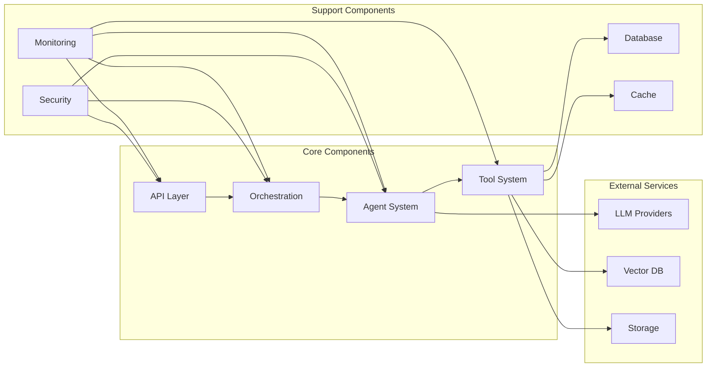

## 2. Request Flow

### 2.1 Complete Request Lifecycle
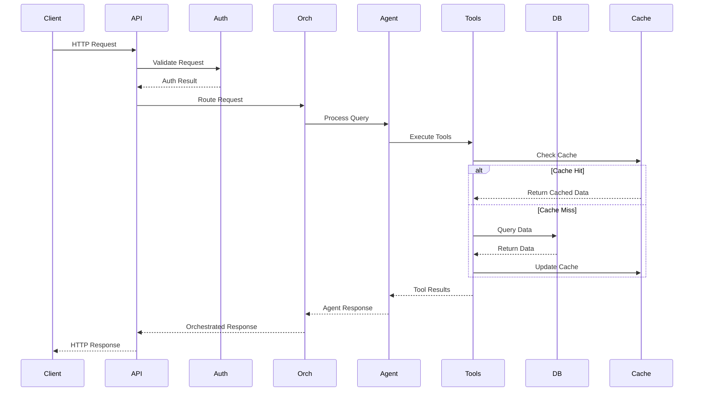

### 2.2 Error Handling Flow
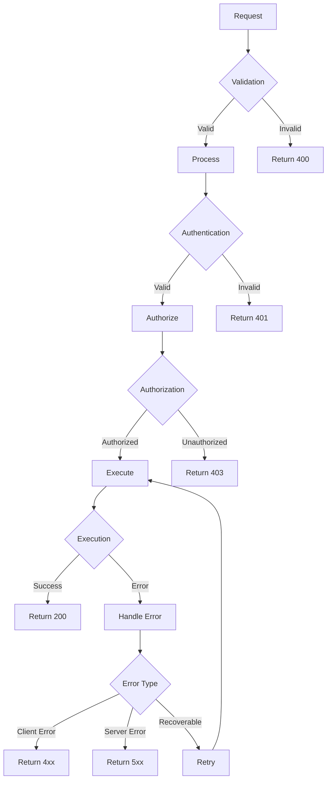

## 3. Agent Interactions

### 3.1 Agent Selection and Handoff
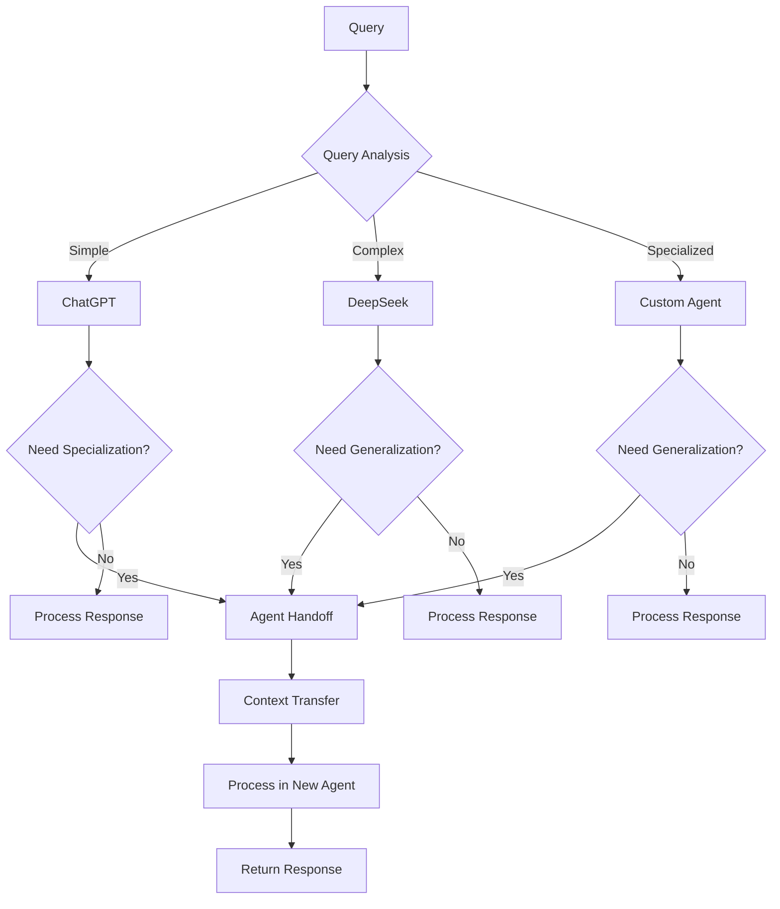

### 3.2 Agent Context Management
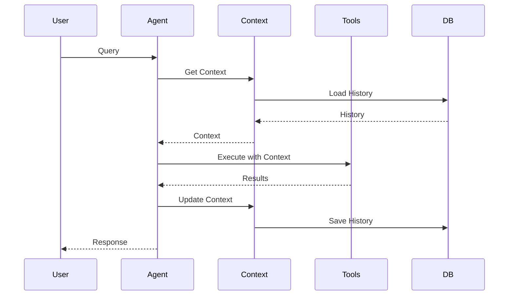

## 4. Tool Execution Flow

### 4.1 Tool Discovery and Registration
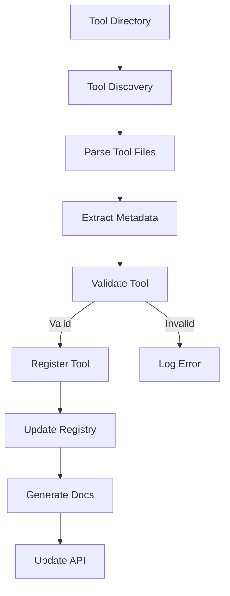

### 4.2 Tool Execution Pipeline
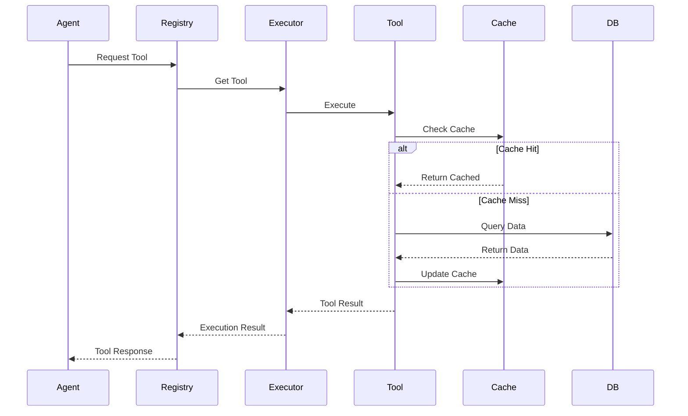

## 5. Monitoring and Observability

### 5.1 Metrics Collection Flow
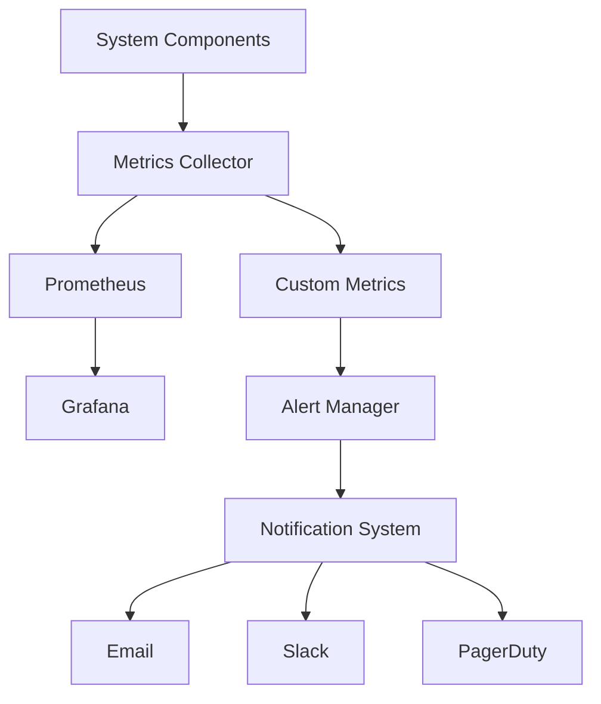

### 5.2 Logging Pipeline
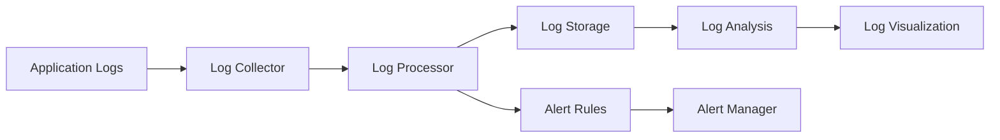

## 6. Data Flow

### 6.1 Data Processing Pipeline
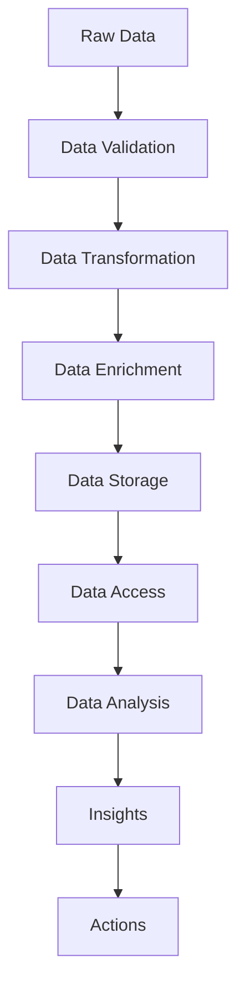

### 6.2 Cache Strategy
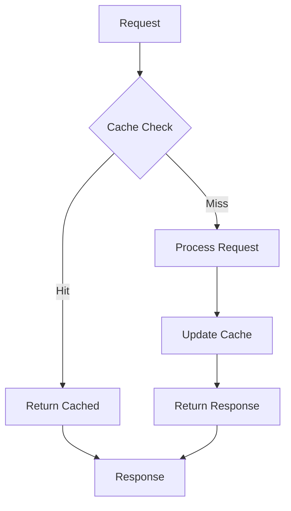

## 7. Security Flow

### 7.1 Authentication Flow
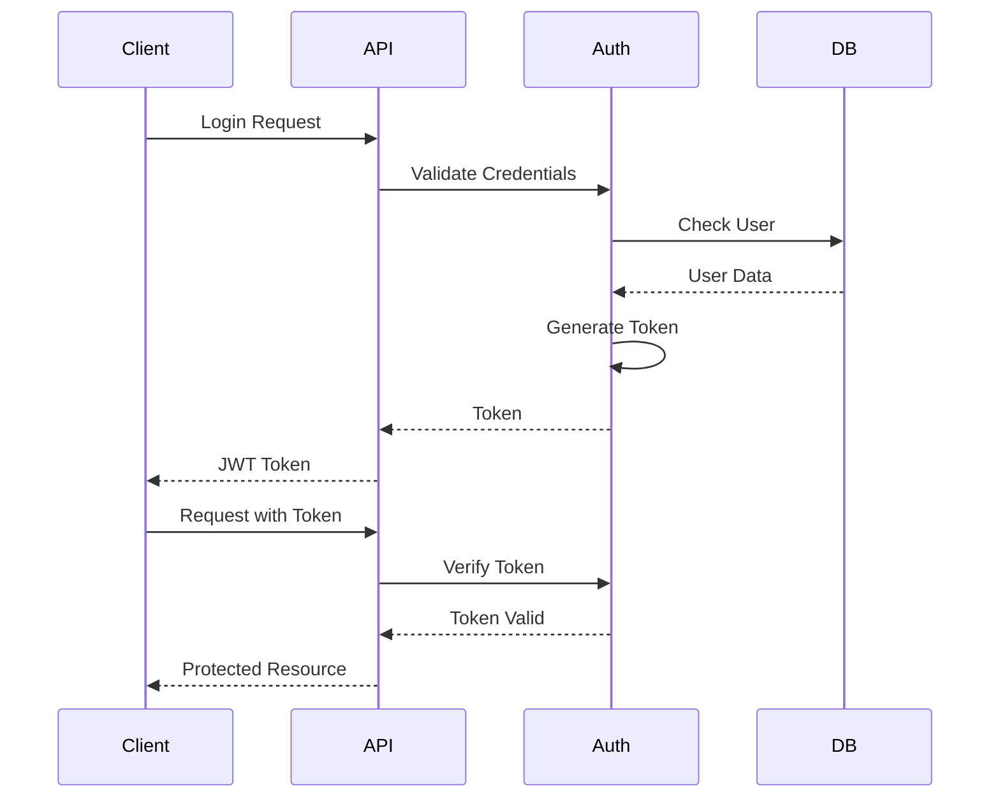

### 7.2 Authorization Flow
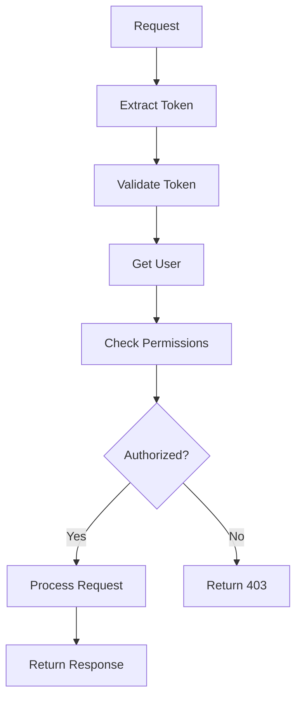

## 8. Deployment Architecture

### 8.1 Kubernetes Deployment
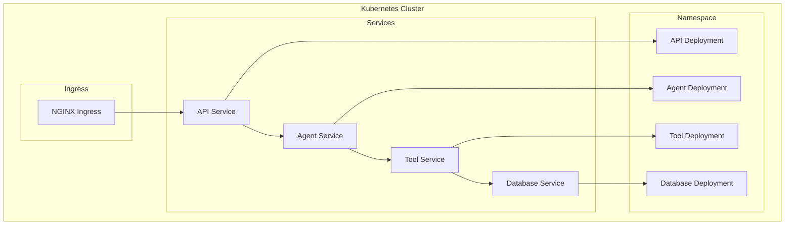

### 8.2 CI/CD Pipeline
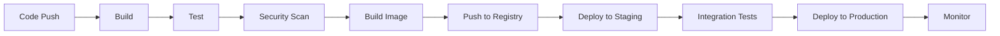

## 9. User Flow and Interaction Details

### 9.1 Complete User Journey
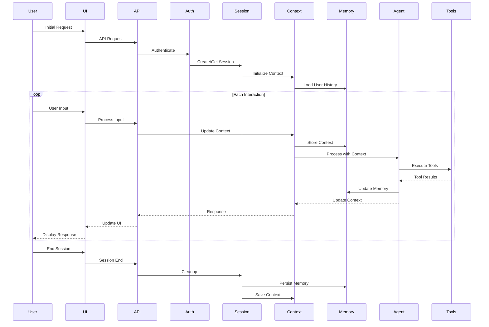

### 9.2 Context Management Details
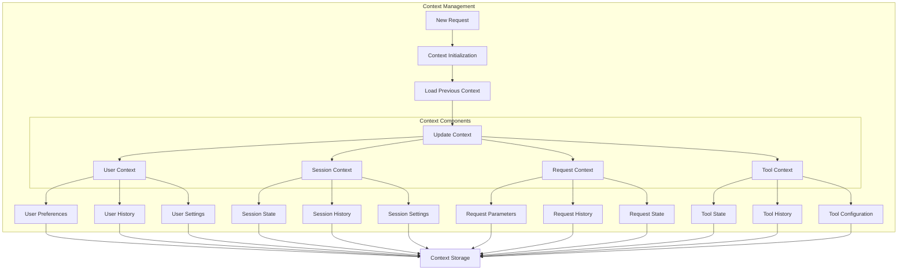

### 9.3 Memory Management System
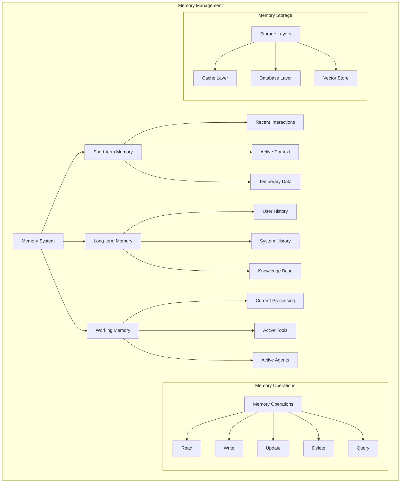

### 9.4 Tracking and Analytics Flow
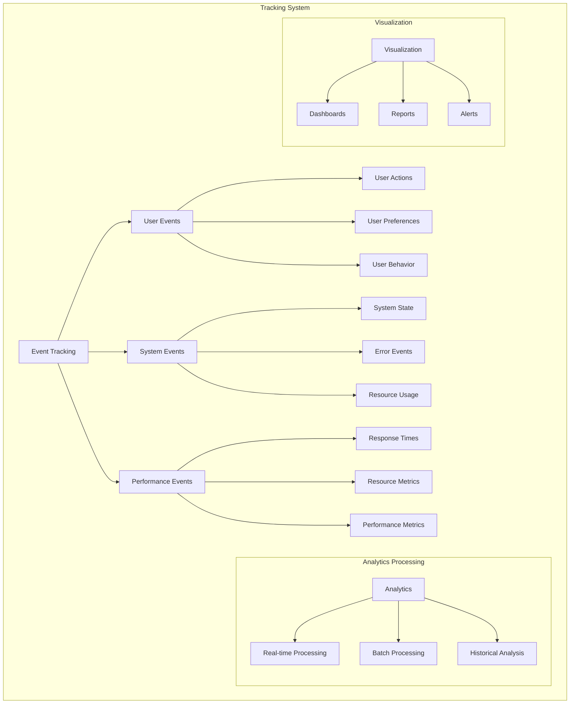

### 9.5 Agent Memory and Learning Flow
```mermaid
sequenceDiagram
    participant User
    participant Agent
    participant Memory
    participant Learning
    participant Knowledge
    participant Tools

    User->>Agent: Query
    Agent->>Memory: Retrieve Context
    Memory->>Agent: Context Data
    
    loop Learning Cycle
        Agent->>Learning: Process Query
        Learning->>Knowledge: Update Knowledge
        Knowledge->>Agent: Enhanced Understanding
        Agent->>Tools: Execute with Learning
        Tools-->>Agent: Results
        Agent->>Memory: Store Learning
    end
    
    Agent->>User: Response
    Agent->>Learning: Update Model
    Learning->>Knowledge: Persist Learning
```

### 9.6 Tool State Management
```mermaid
graph TD
    subgraph Tool State Management
        A[Tool State] --> B[Active State]
        A --> C[Inactive State]
        A --> D[Error State]
        
        B --> E[Execution Context]
        B --> F[Resource Usage]
        B --> G[Performance Metrics]
        
        C --> H[Resource Cleanup]
        C --> I[State Persistence]
        C --> J[Configuration]
        
        D --> K[Error Handling]
        D --> L[Recovery Process]
        D --> M[Error Reporting]
        
        subgraph State Transitions
            N[Transitions] --> O[Initialize]
            N --> P[Activate]
            N --> Q[Deactivate]
            N --> R[Error]
            N --> S[Recover]
        end
    end
```

### 9.7 Session Management Details
```mermaid
graph TD
    subgraph Session Management
        A[Session] --> B[Authentication]
        A --> C[Authorization]
        A --> D[State Management]
        
        B --> E[User Identity]
        B --> F[Credentials]
        B --> G[Token Management]
        
        C --> H[Permissions]
        C --> I[Roles]
        C --> J[Access Control]
        
        D --> K[Session Data]
        D --> L[Context Data]
        D --> M[User Preferences]
        
        subgraph Session Operations
            N[Operations] --> O[Create]
            N --> P[Update]
            N --> Q[Destroy]
            N --> R[Validate]
            N --> S[Refresh]
        end
    end
```

### 9.8 Error Recovery and Resilience
```mermaid
graph TD
    subgraph Error Handling
        A[Error Detection] --> B[Error Classification]
        B --> C[Recovery Strategy]
        
        C --> D[Retry Logic]
        C --> E[Fallback Options]
        C --> F[Circuit Breaking]
        
        D --> G[Exponential Backoff]
        D --> H[Max Retries]
        D --> I[Timeout Handling]
        
        E --> J[Alternative Services]
        E --> K[Default Responses]
        E --> L[Graceful Degradation]
        
        F --> M[Threshold Monitoring]
        F --> N[State Management]
        F --> O[Recovery Triggers]
        
        subgraph Monitoring
            P[Monitoring] --> Q[Error Tracking]
            P --> R[Performance Monitoring]
            P --> S[Health Checks]
        end
    end
``` 