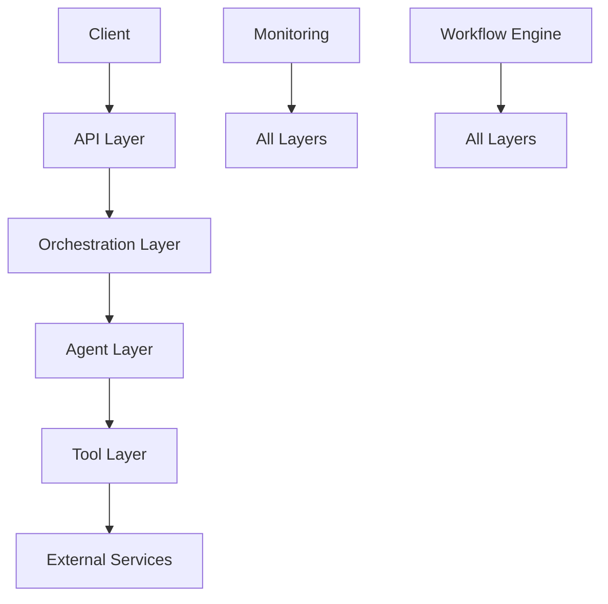
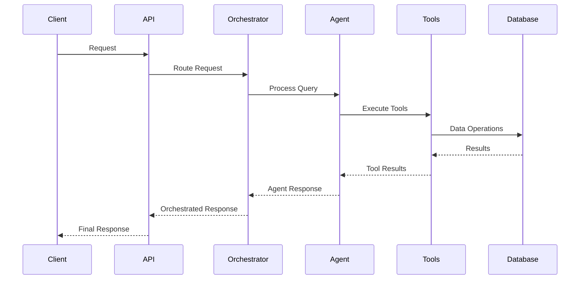

# Comprehensive Training Guide: AI Agent Backend System

## Table of Contents
1. System Architecture Overview
2. Core Components Deep Dive
3. Implementation Guide
4. Best Practices and Patterns
5. Advanced Topics
6. Troubleshooting Guide
7. Security and Configuration
8. Performance Optimization
9. Testing Strategy
10. Deployment and Scaling
11. Monitoring and Observability
12. Real-World Examples

## 1. System Architecture Overview

### 1.1 High-Level Architecture


### 1.2 Component Interaction Flow


## 2. Core Components Deep Dive

### 2.1 API Layer (`src/API/`)

#### 2.1.1 Main Application (`main.py`)
- **Purpose**: Entry point for the FastAPI application
- **Key Features**:
  - Application lifecycle management
  - Dependency injection setup
  - Middleware configuration
  - Route registration
- **Implementation Example**:
```python
@asynccontextmanager
async def lifespan(app: FastAPI):
    # Startup
    settings = get_settings()
    container = Container()
    await container.initialize(settings)
    app.state.container = container
    yield
    # Shutdown
    await app.state.container.cleanup()
```

#### 2.1.2 Configuration (`config/`)
- **container.py**: Dependency injection container
- **settings.py**: Environment configuration
- **database.py**: Database connection management

#### 2.1.3 Middleware (`middleware/`)
- Rate limiting
- Authentication
- CORS handling
- Request validation

#### 2.1.4 Routes (`routes/`)
- Chat endpoints
- Health check endpoints
- Admin endpoints

### 2.2 Agent Layer (`src/agents/`)

#### 2.2.1 Base Agent (`base/`)
- **agent_interface.py**: Abstract base class for all agents
- **Key Methods**:
  ```python
  class BaseAgent:
      async def process_query(self, query: str, **kwargs)
      async def initialize(self)
      async def cleanup(self)
  ```

#### 2.2.2 ChatGPT Agent (`chatgpt/`)
- **core_agent.py**: Main ChatGPT implementation
- **prompt_manager.py**: System prompt management
- **message_builder.py**: Message formatting
- **response_handler.py**: Response processing
- **session_detector.py**: Session management

### 2.3 Tool Registry (`src/tool_registry/`)

#### 2.3.1 Registry (`registry.py`)
- **Purpose**: Central tool management
- **Key Features**:
  - Tool registration
  - Tool discovery
  - Tool categorization
  - Tool execution
- **Implementation Example**:
```python
class ToolRegistry:
    def __init__(self):
        self.tools = {}
        self.categories = {
            "data_retrieval": [],
            "analysis": [],
            "action": [],
            "maintenance": [],
            "notification": []
        }
```

#### 2.3.2 Executor (`executor.py`)
- **Purpose**: Tool execution engine
- **Features**:
  - Parameter validation
  - Error handling
  - Result formatting
  - Execution logging

#### 2.3.3 Discovery (`discovery.py`)
- **Purpose**: Automatic tool discovery
- **Features**:
  - Directory scanning
  - Tool loading
  - Documentation extraction
  - Category assignment

#### 2.3.4 Function Generator (`function_generator.py`)
- **Purpose**: OpenAI function definition generation
- **Features**:
  - Schema generation
  - Documentation formatting
  - Type conversion
  - Parameter validation

### 2.4 Orchestration Layer (`src/orchestration/`)

#### 2.4.1 Coordinator (`coordinator.py`)
- **Purpose**: Main orchestrator
- **Features**:
  - Request routing
  - Agent selection
  - Context management
  - Error handling

#### 2.4.2 Context Manager (`context_manager.py`)
- **Purpose**: Conversation context management
- **Features**:
  - History tracking
  - Metadata management
  - Context preservation
  - Session state

#### 2.4.3 Session Manager (`session_manager.py`)
- **Purpose**: Session lifecycle management
- **Features**:
  - Session creation
  - Timeout handling
  - State persistence
  - Cleanup

### 2.5 Monitoring Layer (`src/monitoring/`)

#### 2.5.1 Data Watchers (`data_watchers/`)
- **Purpose**: Continuous data monitoring
- **Features**:
  - Data change detection
  - Threshold monitoring
  - Pattern recognition
  - Alert generation

#### 2.5.2 Event Detectors (`event_detectors/`)
- **Purpose**: Event detection and analysis
- **Features**:
  - Event pattern matching
  - Condition evaluation
  - Trigger management
  - Alert generation

#### 2.5.3 Schedulers (`schedulers/`)
- **Purpose**: Scheduled task management
- **Features**:
  - Task scheduling
  - Execution tracking
  - Error handling
  - Result logging

## 3. Implementation Guide

### 3.1 Creating a New Agent

1. **Extend Base Agent**:
```python
from agents.base.agent_interface import BaseAgent

class CustomAgent(BaseAgent):
    def __init__(self, tool_registry, context_manager, database):
        super().__init__(tool_registry, context_manager, database)
        self.prompt_manager = PromptManager()
        self.message_builder = MessageBuilder()
        
    async def process_query(self, query: str, **kwargs):
        # 1. Process query
        # 2. Generate response
        # 3. Handle tools
        # 4. Return result
        pass
```

2. **Implement Required Methods**:
```python
    async def initialize(self):
        # Setup resources
        pass
        
    async def cleanup(self):
        # Cleanup resources
        pass
```

### 3.2 Creating a New Tool

1. **Tool Definition**:
```python
@tool_registry.register_tool
def analyze_data(data: dict, parameters: dict) -> dict:
    """
    Analyze data using specified parameters.
    
    Args:
        data: Input data to analyze
        parameters: Analysis parameters
        
    Returns:
        Analysis results
    """
    # Tool implementation
    pass
```

2. **Tool Documentation**:
```python
def get_tool_documentation():
    return {
        "name": "analyze_data",
        "description": "Analyzes data using specified parameters",
        "parameters": {
            "data": {"type": "object", "description": "Input data"},
            "parameters": {"type": "object", "description": "Analysis parameters"}
        },
        "returns": {
            "type": "object",
            "description": "Analysis results"
        }
    }
```

### 3.3 Implementing a Workflow

1. **Workflow Definition**:
```python
class DataAnalysisWorkflow:
    def __init__(self, tool_registry, context_manager):
        self.tool_registry = tool_registry
        self.context_manager = context_manager
        
    async def execute(self, parameters: dict):
        # 1. Validate parameters
        # 2. Execute steps
        # 3. Handle results
        # 4. Return outcome
        pass
```

2. **Workflow Steps**:
```python
    async def _step1(self, parameters: dict):
        # Step 1 implementation
        pass
        
    async def _step2(self, parameters: dict):
        # Step 2 implementation
        pass
```

## 4. Best Practices and Patterns

### 4.1 Error Handling
```python
try:
    result = await self.process_query(query)
except ValidationError as e:
    logger.error(f"Validation error: {e}")
    raise HTTPException(status_code=400, detail=str(e))
except ToolExecutionError as e:
    logger.error(f"Tool execution error: {e}")
    raise HTTPException(status_code=500, detail=str(e))
```

### 4.2 Logging
```python
logger.info(f"Processing query: {query}")
logger.debug(f"Tool parameters: {parameters}")
logger.error(f"Error occurred: {error}", exc_info=True)
```

### 4.3 Testing
```python
async def test_agent_query():
    agent = CustomAgent(tool_registry, context_manager, database)
    result = await agent.process_query("test query")
    assert result is not None
    assert "response" in result
```

## 5. Advanced Topics

### 5.1 Custom Tool Categories
```python
class CustomToolRegistry(ToolRegistry):
    def __init__(self):
        super().__init__()
        self.categories.update({
            "custom_category": []
        })
```

### 5.2 Advanced Monitoring
```python
class CustomDataWatcher(DataWatcher):
    def __init__(self):
        super().__init__()
        self.custom_metrics = {}
        
    async def watch(self, data: dict):
        # Custom monitoring logic
        pass
```

### 5.3 Custom Workflow Patterns
```python
class CustomWorkflowPattern:
    def __init__(self):
        self.patterns = {}
        
    def register_pattern(self, name: str, pattern: dict):
        self.patterns[name] = pattern
```

## 6. Troubleshooting Guide

### 6.1 Common Issues

1. **Tool Registration Failures**
   - Check tool naming convention
   - Verify tool documentation
   - Check parameter types

2. **Agent Communication Issues**
   - Verify API endpoints
   - Check authentication
   - Validate request format

3. **Monitoring Alerts**
   - Check threshold settings
   - Verify data sources
   - Review alert conditions

### 6.2 Debugging Tools

1. **Logging**
```python
logging.basicConfig(level=logging.DEBUG)
logger = logging.getLogger(__name__)
```

2. **Health Checks**
```python
async def health_check():
    return {
        "status": "healthy",
        "components": {
            "database": await check_database(),
            "tools": await check_tools(),
            "agents": await check_agents()
        }
    }
```

3. **Performance Monitoring**
```python
async def monitor_performance():
    return {
        "response_times": await get_response_times(),
        "tool_execution": await get_tool_metrics(),
        "resource_usage": await get_resource_usage()
    }
```

## 7. Security and Configuration

### 7.1 Security Best Practices

#### 7.1.1 Authentication
```python
from fastapi.security import OAuth2PasswordBearer
from jose import JWTError, jwt

class SecurityManager:
    def __init__(self, secret_key: str, algorithm: str = "HS256"):
        self.secret_key = secret_key
        self.algorithm = algorithm
        self.oauth2_scheme = OAuth2PasswordBearer(tokenUrl="token")
    
    async def create_access_token(self, data: dict):
        to_encode = data.copy()
        expire = datetime.utcnow() + timedelta(minutes=15)
        to_encode.update({"exp": expire})
        return jwt.encode(to_encode, self.secret_key, algorithm=self.algorithm)
    
    async def verify_token(self, token: str):
        try:
            payload = jwt.decode(token, self.secret_key, algorithms=[self.algorithm])
            return payload
        except JWTError:
            raise HTTPException(status_code=401, detail="Invalid token")
```

#### 7.1.2 API Key Management
```python
class APIKeyManager:
    def __init__(self, database):
        self.database = database
    
    async def create_api_key(self, user_id: str) -> str:
        api_key = secrets.token_urlsafe(32)
        await self.database.store_api_key(user_id, api_key)
        return api_key
    
    async def validate_api_key(self, api_key: str) -> bool:
        return await self.database.validate_api_key(api_key)
```

### 7.2 Configuration Management

#### 7.2.1 Environment Variables
```python
class Settings(BaseSettings):
    # Database
    DATABASE_URL: str
    DATABASE_POOL_SIZE: int = 5
    
    # API
    API_HOST: str = "0.0.0.0"
    API_PORT: int = 8000
    
    # Security
    SECRET_KEY: str
    ACCESS_TOKEN_EXPIRE_MINUTES: int = 15
    
    # Monitoring
    ENABLE_METRICS: bool = True
    METRICS_PORT: int = 9090
    
    class Config:
        env_file = ".env"
```

#### 7.2.2 Feature Flags
```python
class FeatureManager:
    def __init__(self, database):
        self.database = database
        self.features = {}
    
    async def initialize(self):
        self.features = await self.database.get_feature_flags()
    
    def is_enabled(self, feature: str) -> bool:
        return self.features.get(feature, False)
```

## 8. Performance Optimization

### 8.1 Caching Strategies

#### 8.1.1 Redis Caching
```python
class CacheManager:
    def __init__(self, redis_client):
        self.redis = redis_client
    
    async def get_cached_data(self, key: str) -> Optional[dict]:
        data = await self.redis.get(key)
        return json.loads(data) if data else None
    
    async def set_cached_data(self, key: str, data: dict, ttl: int = 3600):
        await self.redis.set(key, json.dumps(data), ex=ttl)
```

#### 8.1.2 In-Memory Caching
```python
from functools import lru_cache

class MemoryCache:
    @lru_cache(maxsize=1000)
    def get_cached_value(self, key: str) -> Any:
        return self._compute_value(key)
```

### 8.2 Database Optimization

#### 8.2.1 Connection Pooling
```python
class DatabasePool:
    def __init__(self, dsn: str, min_size: int = 5, max_size: int = 20):
        self.pool = await asyncpg.create_pool(
            dsn,
            min_size=min_size,
            max_size=max_size
        )
    
    async def get_connection(self):
        return await self.pool.acquire()
    
    async def release_connection(self, conn):
        await self.pool.release(conn)
```

#### 8.2.2 Query Optimization
```python
class QueryOptimizer:
    def __init__(self, database):
        self.database = database
    
    async def optimize_query(self, query: str) -> str:
        # Add query optimization logic
        return optimized_query
    
    async def create_indexes(self):
        # Create necessary indexes
        pass
```

## 9. Testing Strategy

### 9.1 Unit Testing

#### 9.1.1 Agent Testing
```python
class TestAgent(unittest.TestCase):
    async def setUp(self):
        self.agent = CustomAgent(
            tool_registry=MockToolRegistry(),
            context_manager=MockContextManager(),
            database=MockDatabase()
        )
    
    async def test_process_query(self):
        result = await self.agent.process_query("test query")
        self.assertIsNotNone(result)
        self.assertIn("response", result)
```

#### 9.1.2 Tool Testing
```python
class TestTool(unittest.TestCase):
    async def setUp(self):
        self.tool = AnalyzeDataTool()
    
    async def test_tool_execution(self):
        result = await self.tool.execute({
            "data": {"test": "data"},
            "parameters": {"analysis_type": "basic"}
        })
        self.assertIsNotNone(result)
        self.assertIn("analysis_result", result)
```

### 9.2 Integration Testing

#### 9.2.1 API Testing
```python
class TestAPI(unittest.TestCase):
    async def setUp(self):
        self.app = FastAPI()
        self.client = TestClient(self.app)
    
    async def test_chat_endpoint(self):
        response = await self.client.post(
            "/api/chat",
            json={"query": "test query"}
        )
        self.assertEqual(response.status_code, 200)
        self.assertIn("response", response.json())
```

#### 9.2.2 End-to-End Testing
```python
class TestE2E(unittest.TestCase):
    async def setUp(self):
        self.system = await System.initialize()
    
    async def test_complete_workflow(self):
        # Test complete workflow from API to database
        result = await self.system.execute_workflow({
            "type": "data_analysis",
            "parameters": {"data_id": "test123"}
        })
        self.assertIsNotNone(result)
        self.assertTrue(result["success"])
```

### 9.3 Performance Testing

#### 9.3.1 Load Testing
```python
class LoadTest:
    def __init__(self, target_url: str):
        self.target_url = target_url
    
    async def run_load_test(self, num_requests: int):
        async with aiohttp.ClientSession() as session:
            tasks = [
                self.make_request(session)
                for _ in range(num_requests)
            ]
            results = await asyncio.gather(*tasks)
            return self.analyze_results(results)
```

#### 9.3.2 Stress Testing
```python
class StressTest:
    def __init__(self, system):
        self.system = system
    
    async def run_stress_test(self, duration: int):
        start_time = time.time()
        results = []
        
        while time.time() - start_time < duration:
            result = await self.system.execute_workflow({
                "type": "stress_test",
                "parameters": {"load": "high"}
            })
            results.append(result)
        
        return self.analyze_stress_results(results)
```

## 10. Deployment and Scaling

### 10.1 Deployment Configuration

#### 10.1.1 Docker Configuration
```dockerfile
# Dockerfile
FROM python:3.9-slim

WORKDIR /app

COPY requirements.txt .
RUN pip install --no-cache-dir -r requirements.txt

COPY . .

CMD ["uvicorn", "src.api.main:app", "--host", "0.0.0.0", "--port", "8000"]
```

#### 10.1.2 Kubernetes Configuration
```yaml
# deployment.yaml
apiVersion: apps/v1
kind: Deployment
metadata:
  name: qc-agent
spec:
  replicas: 3
  selector:
    matchLabels:
      app: qc-agent
  template:
    metadata:
      labels:
        app: qc-agent
    spec:
      containers:
      - name: qc-agent
        image: qc-agent:latest
        ports:
        - containerPort: 8000
        env:
        - name: DATABASE_URL
          valueFrom:
            secretKeyRef:
              name: qc-agent-secrets
              key: database-url
```

### 10.2 Scaling Strategies

#### 10.2.1 Horizontal Scaling
```python
class ScalingManager:
    def __init__(self, kubernetes_client):
        self.k8s = kubernetes_client
    
    async def scale_up(self, target_replicas: int):
        await self.k8s.scale_deployment(
            name="qc-agent",
            replicas=target_replicas
        )
    
    async def scale_down(self, target_replicas: int):
        await self.k8s.scale_deployment(
            name="qc-agent",
            replicas=target_replicas
        )
```

#### 10.2.2 Load Balancing
```python
class LoadBalancer:
    def __init__(self, nginx_config):
        self.nginx = nginx_config
    
    async def update_backend_servers(self, servers: List[str]):
        config = self.generate_nginx_config(servers)
        await self.nginx.update_config(config)
    
    def generate_nginx_config(self, servers: List[str]) -> str:
        # Generate nginx configuration
        pass
```

## 11. Monitoring and Observability

### 11.1 Metrics Collection

#### 11.1.1 Prometheus Integration
```python
from prometheus_client import Counter, Histogram

class MetricsCollector:
    def __init__(self):
        self.request_counter = Counter(
            'qc_agent_requests_total',
            'Total number of requests'
        )
        self.response_time = Histogram(
            'qc_agent_response_time_seconds',
            'Response time in seconds'
        )
    
    async def record_request(self):
        self.request_counter.inc()
    
    async def record_response_time(self, duration: float):
        self.response_time.observe(duration)
```

#### 11.1.2 Custom Metrics
```python
class CustomMetrics:
    def __init__(self):
        self.tool_usage = Counter(
            'qc_agent_tool_usage_total',
            'Tool usage count',
            ['tool_name']
        )
        self.error_count = Counter(
            'qc_agent_errors_total',
            'Error count',
            ['error_type']
        )
```

### 11.2 Logging and Tracing

#### 11.2.1 Structured Logging
```python
class StructuredLogger:
    def __init__(self):
        self.logger = logging.getLogger("qc_agent")
        self.setup_logging()
    
    def setup_logging(self):
        handler = logging.StreamHandler()
        formatter = logging.Formatter(
            '%(asctime)s - %(name)s - %(levelname)s - %(message)s'
        )
        handler.setFormatter(formatter)
        self.logger.addHandler(handler)
    
    def log_event(self, event_type: str, data: dict):
        self.logger.info(
            f"Event: {event_type}",
            extra={"event_data": data}
        )
```

#### 11.2.2 Distributed Tracing
```python
class TraceManager:
    def __init__(self, tracer):
        self.tracer = tracer
    
    async def start_span(self, name: str):
        return self.tracer.start_span(name)
    
    async def add_span_attribute(self, span, key: str, value: Any):
        span.set_attribute(key, value)
```

## 12. Real-World Examples

### 12.1 Manufacturing Quality Control

#### 12.1.1 Quality Check Workflow
```python
class QualityCheckWorkflow:
    def __init__(self, tool_registry, context_manager):
        self.tool_registry = tool_registry
        self.context_manager = context_manager
    
    async def execute(self, parameters: dict):
        # 1. Get product data
        product_data = await self.get_product_data(parameters["product_id"])
        
        # 2. Run quality checks
        quality_results = await self.run_quality_checks(product_data)
        
        # 3. Generate report
        report = await self.generate_quality_report(quality_results)
        
        # 4. Store results
        await self.store_results(report)
        
        return report
```

#### 12.1.2 Quality Metrics Analysis
```python
class QualityMetricsAnalyzer:
    def __init__(self, database):
        self.database = database
    
    async def analyze_metrics(self, time_range: dict):
        # 1. Get metrics data
        metrics = await self.get_metrics(time_range)
        
        # 2. Calculate statistics
        stats = self.calculate_statistics(metrics)
        
        # 3. Identify trends
        trends = self.identify_trends(metrics)
        
        # 4. Generate insights
        insights = self.generate_insights(stats, trends)
        
        return {
            "statistics": stats,
            "trends": trends,
            "insights": insights
        }
```

### 12.2 Maintenance Management

#### 12.2.1 Maintenance Scheduling
```python
class MaintenanceScheduler:
    def __init__(self, tool_registry, context_manager):
        self.tool_registry = tool_registry
        self.context_manager = context_manager
    
    async def schedule_maintenance(self, parameters: dict):
        # 1. Get equipment data
        equipment = await self.get_equipment_data(parameters["equipment_id"])
        
        # 2. Check maintenance history
        history = await self.get_maintenance_history(equipment["id"])
        
        # 3. Calculate next maintenance date
        next_date = self.calculate_next_maintenance(equipment, history)
        
        # 4. Create maintenance schedule
        schedule = await self.create_maintenance_schedule(
            equipment["id"],
            next_date,
            parameters["maintenance_type"]
        )
        
        return schedule
```

#### 12.2.2 Maintenance Analytics
```python
class MaintenanceAnalytics:
    def __init__(self, database):
        self.database = database
    
    async def analyze_maintenance_data(self, time_range: dict):
        # 1. Get maintenance records
        records = await self.get_maintenance_records(time_range)
        
        # 2. Calculate metrics
        metrics = self.calculate_maintenance_metrics(records)
        
        # 3. Generate insights
        insights = self.generate_maintenance_insights(metrics)
        
        # 4. Create recommendations
        recommendations = self.create_maintenance_recommendations(insights)
        
        return {
            "metrics": metrics,
            "insights": insights,
            "recommendations": recommendations
        }
``` 